# Auditoría de producto, UX y accesibilidad — PecadosVip

Fecha: **2026-08-30**
Superficie: preview sintético local y evidencia visual guardada en esta carpeta
Base Git observada: `ec6190ecc23a29d6cbdd0b3977cdfb3f09a1b3a9` con cambios locales sin commit
Modo: revisión de evidencia, navegador local y mediciones DOM; no se probó un despliegue público

## Veredicto

**PASS WITH LIMITS para el flujo sintético local.** La cuarta tarjeta de la zona Barcelona quedó completada con Sitges, la cuadrícula mantiene continuidad visual en los cuatro anchos observados y los controles auditados funcionaron en el navegador local según `design-qa.md:167-178`.

Este resultado no convierte el preview en producto publicable. Perfiles, servicios, imágenes y cobertura siguen siendo sintéticos o pendientes; contacto y reserva permanecen desactivados. La experiencia pública desplegada, contenido real, revisión lingüística humana, accesibilidad con tecnología de asistencia, UAT y aceptación del cliente siguen sin probarse.

## Alcance y objetivo

- Objetivo de usuario local: descubrir la propuesta, explorar cobertura, buscar y filtrar perfiles o servicios, abrir una ficha y comprender que nada está publicado ni reservable.
- Objetivo de accesibilidad: comprobar estructura visual, reflow básico, señales de foco y comportamiento del menú móvil sin afirmar conformidad WCAG.
- Viewports con evidencia: `1440`, `1180`, `780`, `390` y una captura intermedia de `922` px.
- Evidencia: 18 capturas inspeccionadas, más el registro de navegación, controles de `design-qa.md` y mediciones DOM de interlineado.
- Límites: sin lector de pantalla, zoom real 200/400 %, forced-colors, dispositivo físico, recorrido público con datos reales, red externa ni build desplegado.

## Fortalezas confirmadas en la evidencia local

- Jerarquía editorial consistente: negro, marfil y dorado; hero, tarjetas y llamadas a la acción se distinguen con claridad.
- Los avisos `PREVIEW LOCAL`, `NO PUBLICAR`, `Generado con IA`, `cobertura no confirmada` y `reserva desactivada` reducen el riesgo de confundir la maqueta con una oferta activa.
- Sitges elimina la celda vacía de Barcelona sin ocultar el problema con relleno decorativo.
- Las cuadrículas observadas no muestran recurso roto ni desbordamiento horizontal; `design-qa.md` registra `0 px` de overflow.
- Filtros, detalle, selector de idioma y menú móvil conservan una arquitectura comprensible.
- El menú móvil documenta trampa/restauración de foco, bloqueo de scroll y fondo `inert`/`aria-hidden`; es una fortaleza de implementación local, no una prueba con lector de pantalla.

## Pasos auditados

| # | Paso y descripción | Salud general | Evidencia y límite |
|---:|---|---|---|
| 1 | Entrar a la portada en escritorio y reconocer marca, propuesta y estado local. | **SANO LOCAL** | El hero es legible y separa CTA primario/secundario; la reserva está desactivada. `flow/01-home-hero-desktop.jpg`. |
| 2 | Revisar la portada en ancho móvil/intermedio y corregir la colisión de descendentes. | **CORREGIDO / SANO LOCAL CON LÍMITES** | El título y subtítulo usan bloques separados e interlineado `1.15`; la medición DOM no registra intersección ni overflow a 1280/390 px. Falta zoom real y dispositivo físico. `typography/01-hero-es-922-antes.jpg`, `typography/02-hero-es-390-despues.jpg`. |
| 3 | Llegar a cobertura y diagnosticar la cuadrícula anterior. | **HALLAZGO P2 RESUELTO** | Barcelona terminaba con tres tarjetas y una celda visualmente vacía. `before/01-cobertura-desktop-antes.jpg`, `before/02-cobertura-hueco-barcelona-antes.jpg`. |
| 4 | Revisar la zona Barcelona corregida a 1440 px. | **CORREGIDO / SANO LOCAL** | Sitges completa la cuadrícula 2 × 2 junto a Barcelona, Tarragona y Girona. `after/01-cobertura-desktop-1440.jpg`. |
| 5 | Revisar cobertura a 1180 px. | **SANO LOCAL** | Dos zonas equilibradas, cuatro tarjetas por zona y bordes cerrados. `after/02-cobertura-1180.jpg`. |
| 6 | Revisar cobertura a 780 px. | **SANO LOCAL** | La composición mantiene dos columnas sin overflow; la navegación inferior sigue visible. `after/02-cobertura-780.jpg`. |
| 7 | Revisar cobertura a 390 px. | **SANO LOCAL** | Una columna continua y tarjetas legibles; falta prueba de target size y zoom. `after/02-cobertura-390.jpg`. |
| 8 | Explorar el directorio de ciudades/servicios a 1440 px. | **SANO LOCAL** | Ocho ciudades en una referencia horizontal, con estados pendientes y disclosure IA. `after/03-servicios-ciudades-1440.jpg`. |
| 9 | Revisar el directorio a 1180 px. | **SANO LOCAL** | La transición de contenido y la tira visual conservan jerarquía. `after/03-servicios-ciudades-1180.jpg`. |
| 10 | Revisar servicios a 780 px. | **SANO LOCAL CON LÍMITES** | El contenido se apila y mantiene copy prudente; no se probaron todos los estados de foco/zoom. `after/03-servicios-ciudades-780.jpg`. |
| 11 | Revisar ciudades/servicios a 390 px. | **SANO LOCAL** | Una columna sin corte visible; falta prueba manual de lectura completa con AT. `after/03-servicios-ciudades-390.jpg`. |
| 12 | Buscar dentro del catálogo sintético. | **SANO LOCAL** | `design-qa.md:173` registra búsqueda operativa; no existe evidencia de búsqueda en producción o con contenido real. |
| 13 | Aplicar filtros de ciudad/estado y ordenar resultados. | **SANO LOCAL** | El filtro Barcelona muestra tres perfiles ficticios y mantiene CTA de aplicar/restablecer. `flow/02-perfiles-filtrados-barcelona.jpg`. |
| 14 | Seleccionar temporalmente hasta tres servicios y recibir aviso de límite. | **SANO LOCAL** | La selección y el límite anunciado operaron según `design-qa.md:173`; no es una reserva ni persiste una transacción. |
| 15 | Abrir una ficha de servicio y consultar su explicación/FAQ. | **SANO LOCAL CON LÍMITES** | La ficha diferencia concepto, funcionamiento y límites; continúa siendo editorial sintética. `flow/04-servicio-detalle.jpg`. |
| 16 | Abrir perfiles filtrados para Barcelona. | **SANO LOCAL** | Los tres resultados se presentan como ficticios y no disponibles comercialmente. `flow/02-perfiles-filtrados-barcelona.jpg`. |
| 17 | Abrir la ficha de Sofía y recorrer su galería. | **SANO LOCAL CON LÍMITES** | La identidad, origen IA y publicación no autorizada son visibles; contacto y reserva están desactivados. `flow/03-perfil-sofia.jpg`. |
| 18 | Cambiar entre ES/EN/FR/IT. | **FUNCIONAL LOCAL / NO APTO MULTILINGÜE** | El selector operó localmente, pero la auditoría multilingüe detectó `<html lang="es">` y copy español persistente en variantes del preview. No equivale a equivalencia lingüística. |
| 19 | Abrir, recorrer y cerrar el menú móvil. | **SANO LOCAL CON LÍMITES** | Menú claro, locales y rutas visibles; la implementación declara manejo de foco. Falta lector de pantalla/teclado completo por locale. `flow/05-menu-movil.jpg`. |
| 20 | Completar el flujo público real hasta contacto/reserva. | **BLOQUEADO / NO PROBADO** | El producto público permanece en holding fail-closed; no hubo contenido real, contacto activo, staging ni despliegue. |

## Evidencia visual inspeccionada

### Antes y después de la zona Barcelona

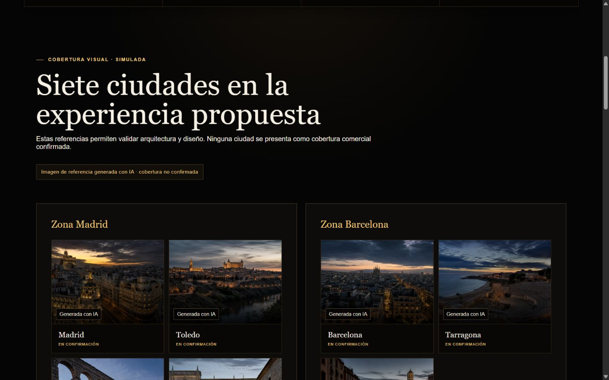

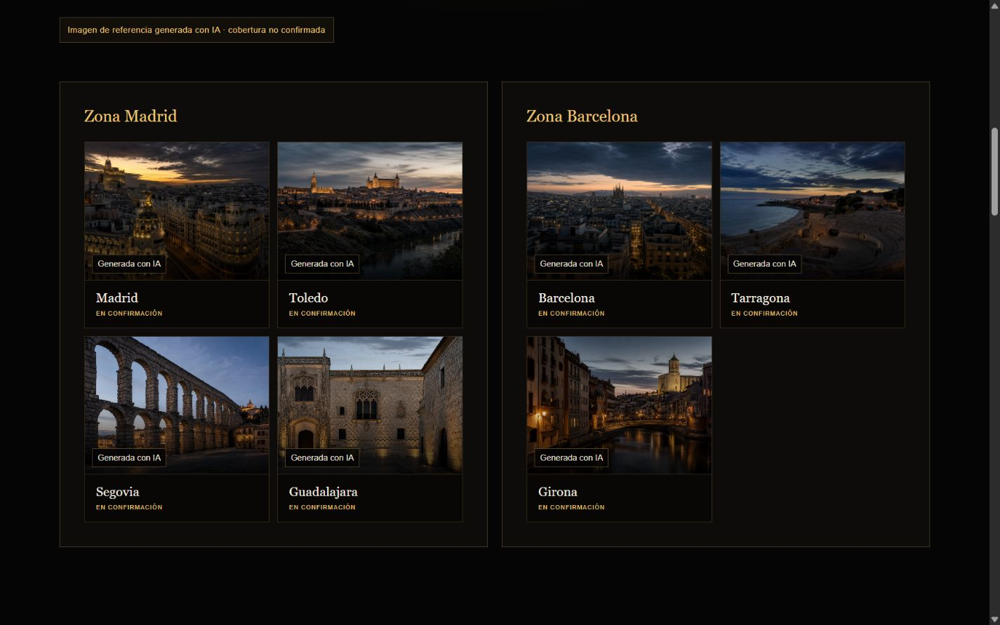

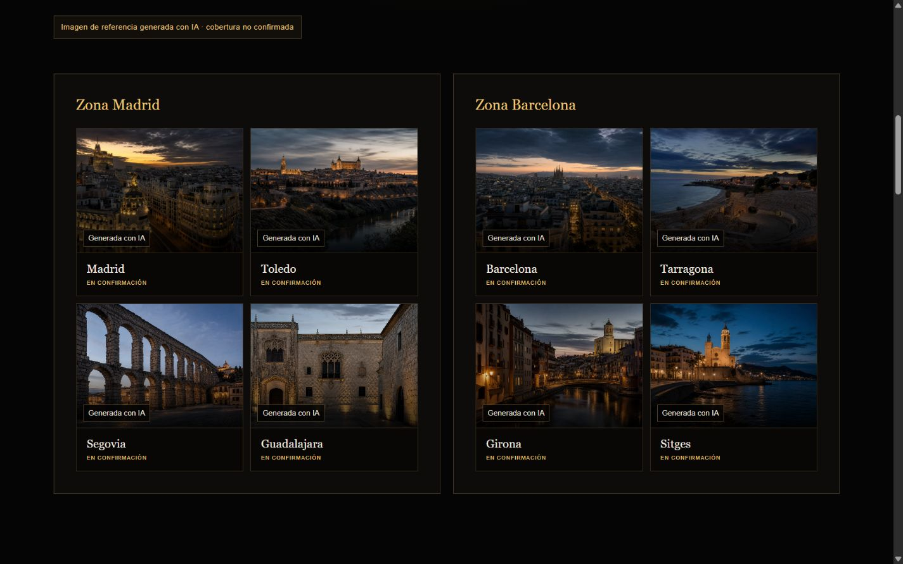

### Responsive de cobertura

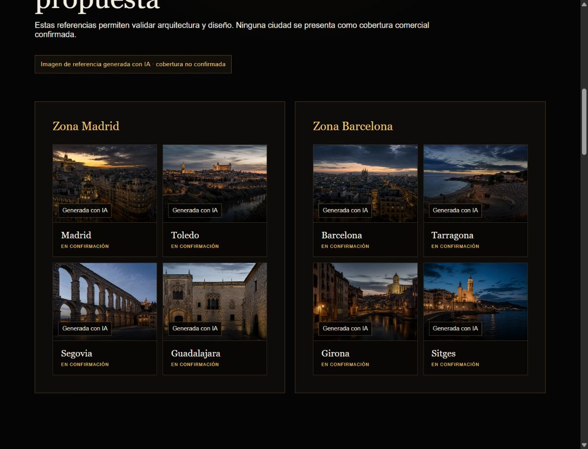

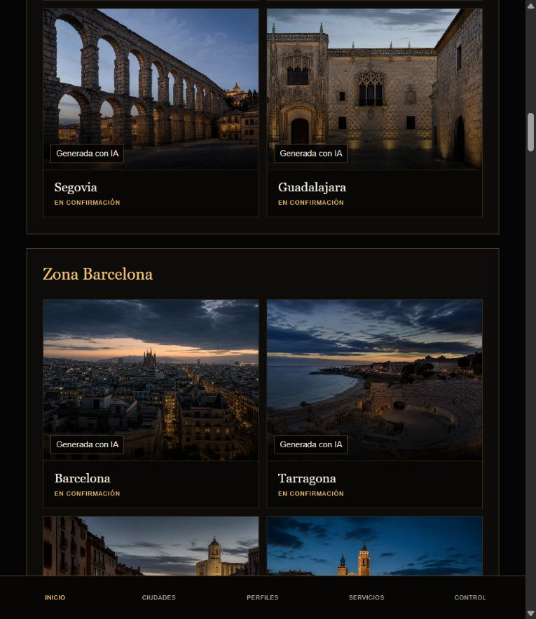

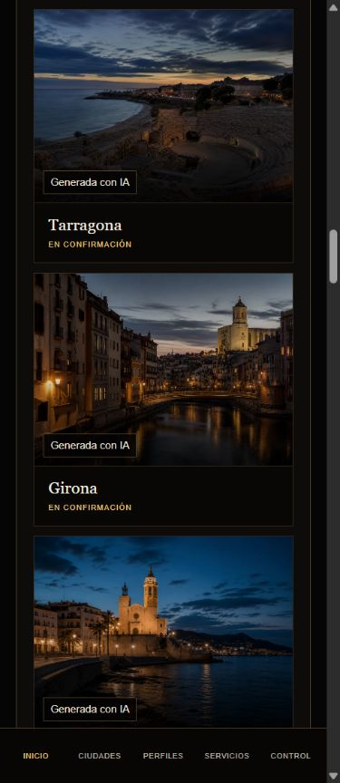

### Directorio de ciudades y servicios

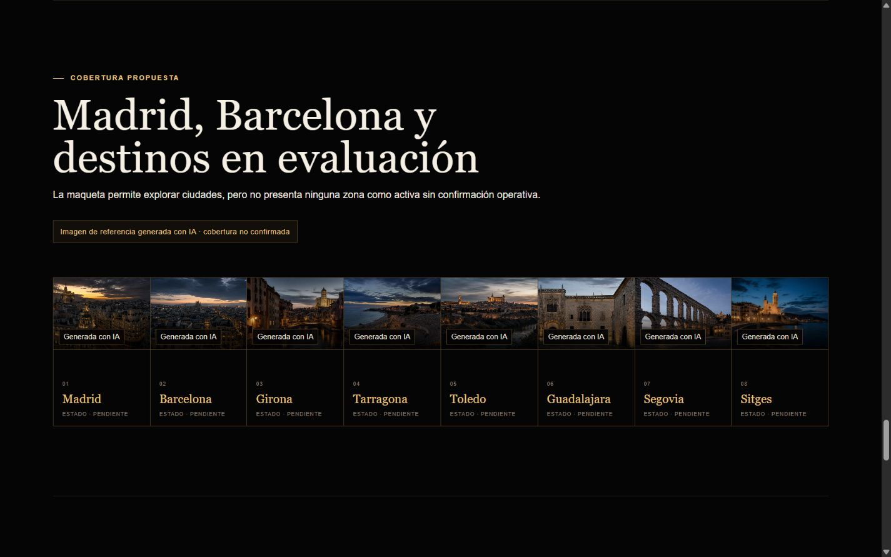

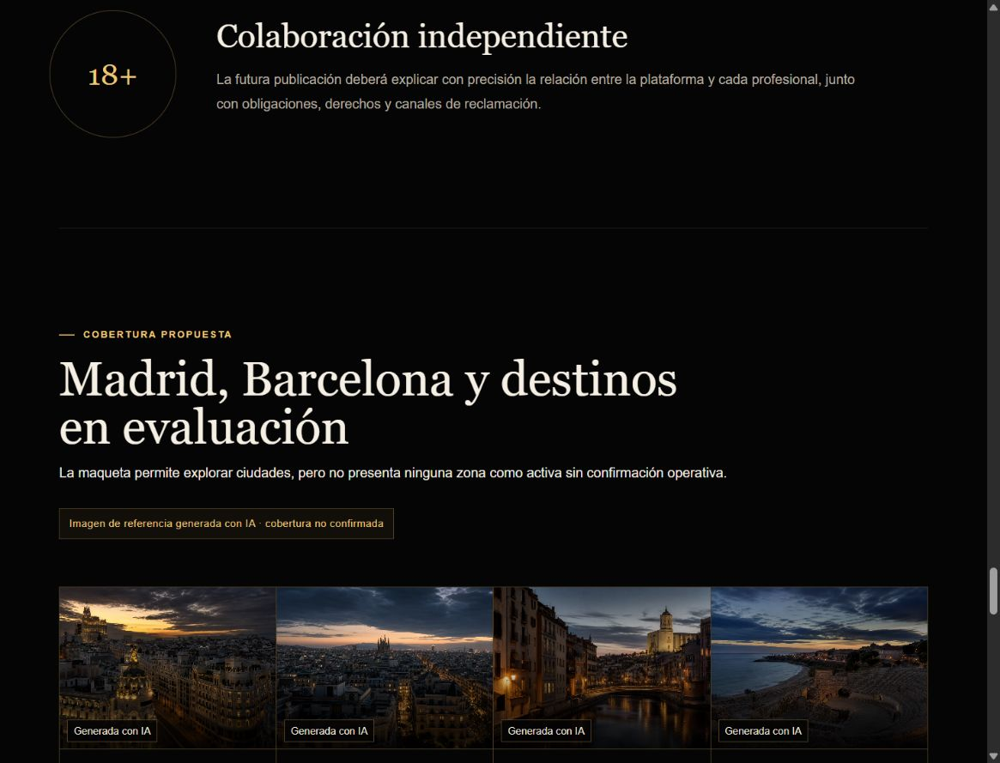

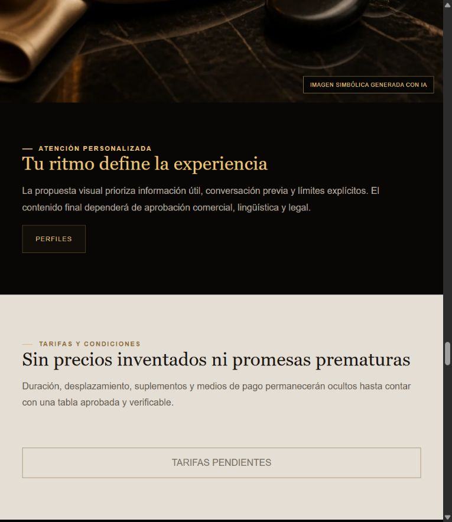

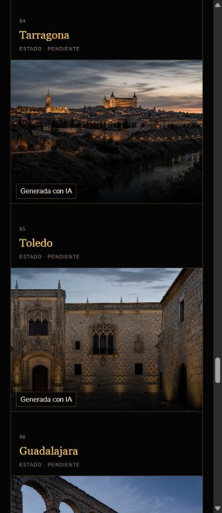

### Flujo local

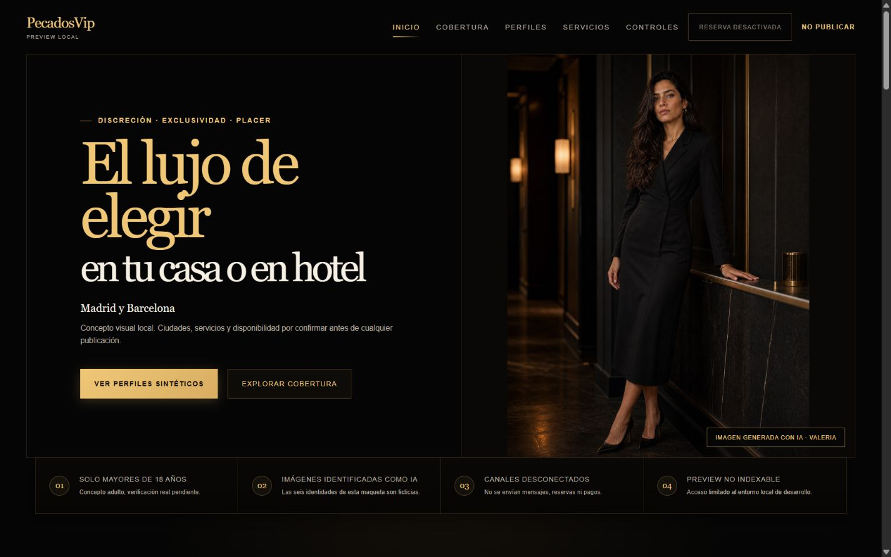

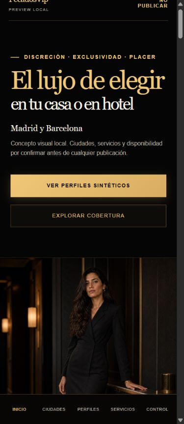

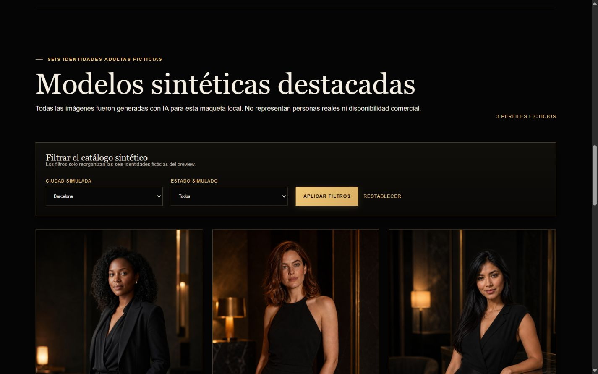

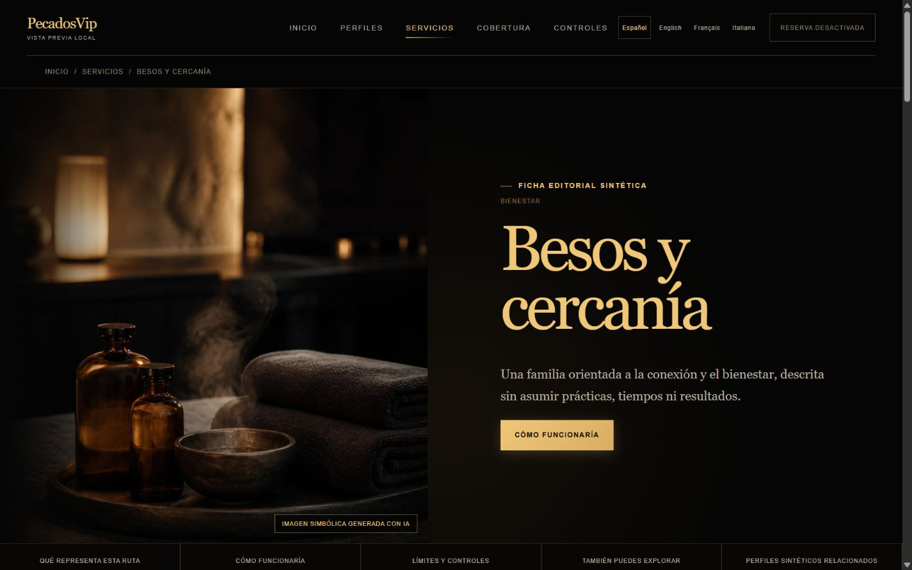

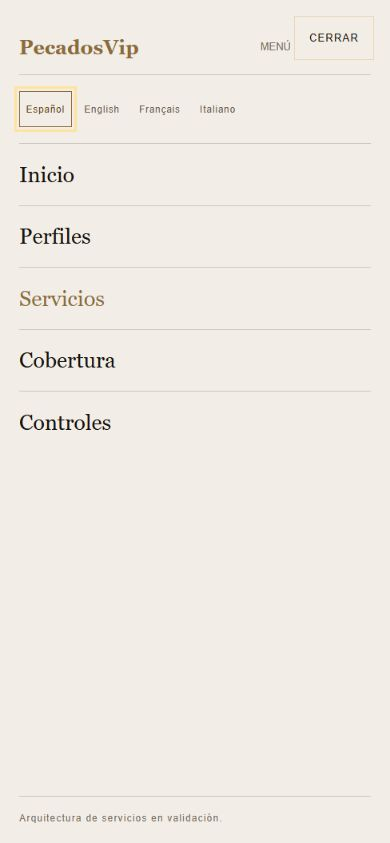

### Evidencia tipográfica intermedia

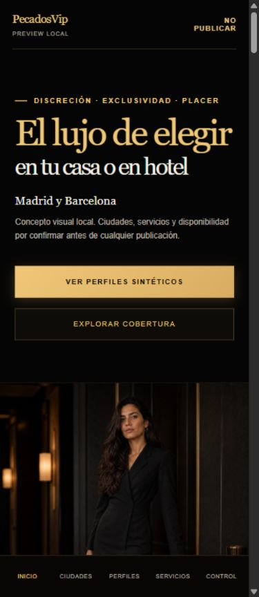

## Riesgos y oportunidades

### UX

- El preview transmite bien que es ficticio, pero tantos avisos de control compiten con la propuesta principal; en producción deberán sustituirse por contenido y estados aprobados, no simplemente ocultarse.
- La tira de ocho ciudades a gran ancho es útil como mapa visual, pero en móvil se vuelve una secuencia larga. Conviene validar navegación por anclas, resumen previo o agrupación cuando exista una referencia de diseño aprobada.
- El selector de idioma parece operativo, pero la experiencia subyacente no es equivalente fuera de español; conservarlo así en una publicación sería una promesa mayor que la evidencia disponible.

### Accesibilidad

- No se puede afirmar conformidad WCAG desde capturas y contratos automatizados.
- La colisión visible de descendentes quedó resuelta en los encabezados auditados; debe conservarse como regresión visual y DOM.
- Faltan teclado completo, orden de foco, mensajes de cambio, zoom/reflow 200/400 %, contraste en estados, forced-colors y lector de pantalla para cada locale.
- Deben validarse tamaño de objetivos y legibilidad de textos secundarios dorados/grises en dispositivo físico.

## Roadmap

### P0 — antes de cualquier publicación

1. Mantener holding, `noindex`, contacto y reserva cerrados hasta aprobar contenido, cobertura, perfiles, derechos, legales y operación.
2. Corregir equivalencia ES/EN/FR/IT y `<html lang>`; obtener revisión lingüística humana independiente.
3. Seleccionar y aprobar una referencia visual controladora y ejecutar UAT sobre el build exacto candidato.

### P1 — calidad y accesibilidad

1. Ejecutar el flujo completo por locale con teclado, zoom 200/400 %, reflow, lector de pantalla y errores reales.
2. Validar navegación móvil larga, target sizes, contraste y estados de foco.
3. Probar portada → cobertura → perfiles/servicios → ficha → contacto en staging autorizado con contenido aprobado.

### P2 — refinamiento

1. Reducir redundancia de avisos cuando exista un producto real sin perder transparencia.
2. Optimizar el descubrimiento móvil de ocho ciudades.
3. Mantener una regresión visual de los cuatro viewports para evitar que reaparezca la celda vacía.

## Cierre

El defecto visual de la cuarta zona Barcelona está **cerrado localmente** y los pasos auditados son saludables dentro del preview sintético. La conclusión válida es `PASS WITH LIMITS local`; el producto público continúa **NO PROBADO y NO AUTORIZADO**.
